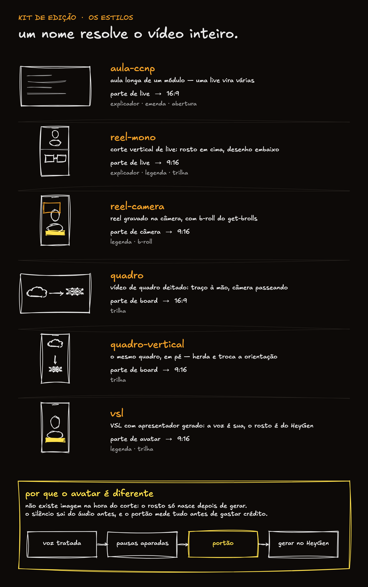

# Kit de Edição de Vídeo com Claude Code — Instalação

<div align="center">
  
</div>

Um comando edita qualquer um deles. O que muda é o **estilo** — e depois de
instalar, `estilo.py` lista os que você tem.

---


Descompacte o ZIP. Abra o Claude Code em qualquer pasta e **cole o bloco
abaixo inteiro**, trocando o caminho da primeira linha pelo lugar onde você
descompactou.

O bloco é a instalação em si: o Claude ainda não conhece este kit, então quem
carrega as instruções é você.

```
A pasta do kit está em ~/Downloads/kit-edicao-video. Instale assim:

1. Copie a pasta `skill/` de lá para ~/.claude/skills/editar-video/
2. Copie `dependencias/grill-me/` e `dependencias/grilling/` para
   ~/.claude/skills/. Se alguma das duas já existir, deixe a que está lá.
3. Instale o que falta no sistema: `ffmpeg` e `uv` (via Homebrew no Mac)
4. Rode `uv sync` dentro de ~/.claude/skills/editar-video/
5. Confirme com:
   ~/.claude/skills/editar-video/.venv/bin/python \
     ~/.claude/skills/editar-video/helpers/transcribe.py --help
6. Me diga se deu certo. Se o Homebrew não existir, me avise em vez de tentar
   instalar por conta própria.
```

Leva uns 2 minutos. O modelo de transcrição (~1,5 GB) só é baixado no primeiro
vídeo, não agora.

Corte, voz tratada, loudness e legenda funcionam com o `brew install ffmpeg`
puro — nada de compilar ffmpeg, nada de codec extra.

A única coisa que pede mais é o overlay animado (aqueles cards que entram por
cima da tela), que quer Node 20+. Não é o padrão: se você não pedir, o kit não
usa.

## O que vem junto

`grill-me` e `grilling` são de Matt Pocock, sob licença MIT, e vêm no pacote
porque o kit usa a entrevista delas para descobrir suas preferências de edição.
A licença está em `dependencias/LICENSE-mattpocock-skills`. Se você já usa o
plugin dele, pule o passo 2 — as suas continuam valendo.

## Depois

Feche e abra o Claude Code — ele lê as skills ao iniciar. Aí é só pedir:

```
edita ~/Desktop/live.mp4 — divide em aulas de 5 a 10 min
```

```
faz um reel de 60s de ~/Desktop/gravacao.mp4 — hook forte nos primeiros 3s
```

O Claude transcreve, propõe o plano de corte e espera você confirmar antes de
renderizar.

Na primeira edição ele entrevista você — formato, resolução, legendas, idioma —
e guarda tudo em `~/.claude/skills/editar-video/preferences.md`. Para mudar
depois, peça "atualiza minhas preferências de edição" ou edite o arquivo na mão.

---

**Dúvidas**: Discord da Ninja Academy.
