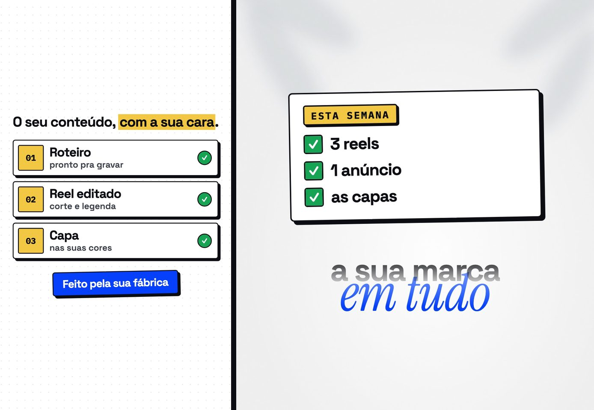
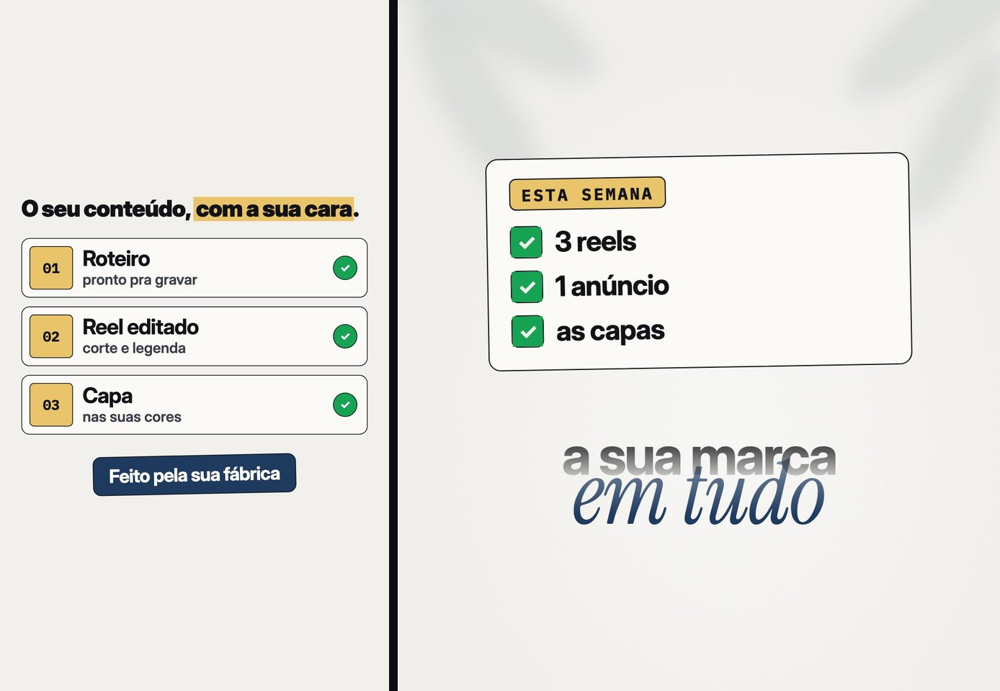
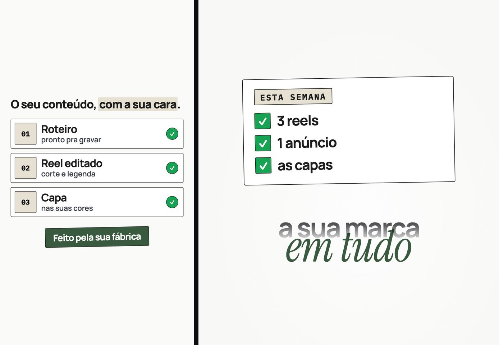
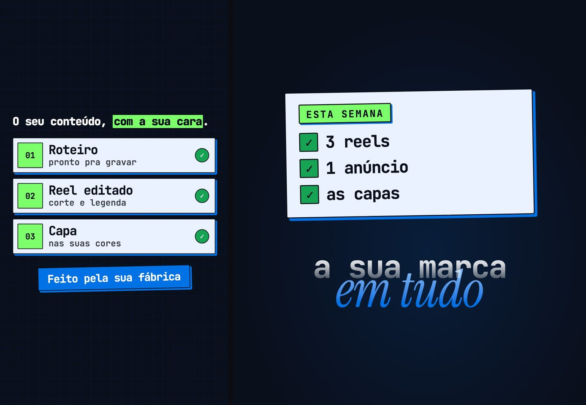
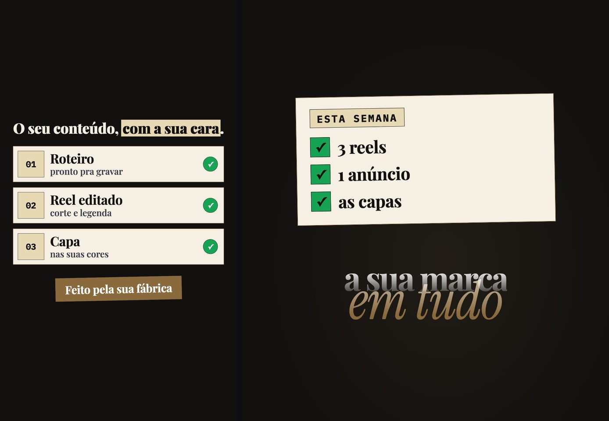
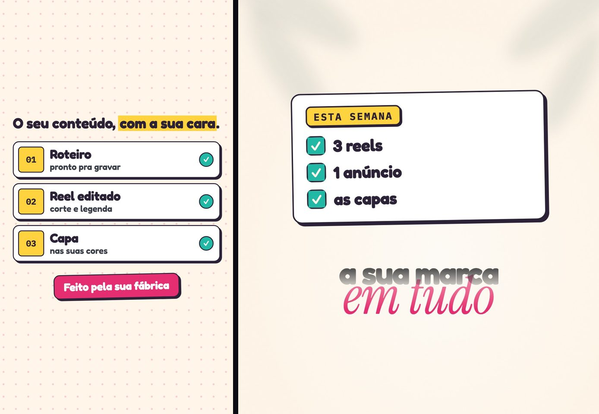

# Guia de estilos

A fábrica vem com a nossa cara: papel claro, azul em bloco, amarelo de marcador, borda
grossa e sombra dura. Para os seus vídeos saírem com a sua, escolha um estilo deste guia,
tire as cores no Coolors e cole um pedido no seu agente de IA. Ele monta a pasta `marca/`,
e todo vídeo dali pra frente sai nela, das peças à capa.

A própria fábrica desenhou cada quadro abaixo, no tema do estilo. À esquerda fica uma
peça de lista; à direita, o painel de cima do reel editorial.

## Os sete estilos

| Estilo | Chão | Letra | Borda e sombra | Combina com |
|---|---|---|---|---|
| Neobrutalista | claro, pontilhado | sem serifa, pesada | grossa, sombra dura | quem ensina, tecnologia, serviço direto |
| Noturno | escuro | sem serifa, pesada | grossa, sombra na cor do marcador | quem quer contraste forte |
| Editorial | papel quase branco, liso | sem serifa apertada e itálico serifado | fina, sem sombra | consultoria, finanças, negócios |
| Minimalista | branco, liso | sem serifa, leve | fina, sem sombra | arquitetura, design, bem-estar |
| Tech | escuro, em grade | monoespaçada | média, sombra na cor do bloco | programação, automação, software |
| Luxo | escuro, liso | serifada | filete dourado, sem sombra | moda, joia, estética, imóvel |
| Divertido | creme, bolinha colorida | redonda | grossa, sombra dura, canto redondo | doce, festa, criança, pet |

O movimento não muda de um estilo pro outro: a peça cai e assenta, e o marcador varre a
palavra. Sem sombra, a peça só assenta, sem o pouso.

### Neobrutalista



É o nosso, e é o que a fábrica usa se você não pedir nada. Vai bem pra quem ensina e
pra serviço que quer parecer direto.

Papel branco, letra quase preta, um bloco forte (o nosso é azul) e um marcador quente (o
nosso é amarelo). A letra é a Space Grotesk, pesada. Borda grossa, sombra dura sem
desfoque, papel pontilhado.

```
adapta a fábrica pra minha marca, seguindo o docs/guia-de-estilos.md: estilo neobrutalista, cores #FFFFFF #0B0D12 #0640FB #F2C744, letra Space Grotesk. Sobre mim: <o que você vende, pra quem, e o seu jeito de falar em três palavras>
```

### Noturno


O neobrutalista no escuro. Os cartões continuam claros, o texto solto no chão sai
branco e a sombra dura pega a cor do marcador. Bom pra games e pra quem quer contraste
forte.

Chão escuro, cartão claro, um bloco forte e um marcador vivo. A letra é a mesma Space
Grotesk.

```
adapta a fábrica pra minha marca, seguindo o docs/guia-de-estilos.md: estilo noturno, cores #0B0D12 #FFFFFF #0640FB #F2C744, letra Space Grotesk. Sobre mim: <o que você vende, pra quem, e o seu jeito de falar em três palavras>
```

### Editorial



Cara de revista. Papel creme quase branco, letra sem serifa apertada e um itálico
serifado de acento. Combina com consultoria e finanças, e com quem fala muito na câmera.

O bloco pede uma cor sóbria, como azul-marinho ou vinho, e o marcador fica no dourado ou
na areia. A letra é a Inter, que já vem na fábrica; o itálico é a Instrument Serif. Borda
fina, canto redondo e nenhuma sombra.

```
adapta a fábrica pra minha marca, seguindo o docs/guia-de-estilos.md: estilo editorial, cores #F1F0EC #121316 #1F3A5F #E9C46A, letra Inter. Sobre mim: <o que você vende, pra quem, e o seu jeito de falar em três palavras>
```

### Minimalista



Muito branco e uma cor só de acento, com um marcador que quase some. Vai bem com
arquitetura, design e bem-estar.

Letra grafite, um acento discreto (no quadro, verde-musgo) e um marcador claro, quase sem
cor. A letra é a Manrope. Borda fina, canto quase reto, sem sombra e sem textura.

```
adapta a fábrica pra minha marca, seguindo o docs/guia-de-estilos.md: estilo minimalista, cores #FAFAF8 #1C1C1C #3A5A40 #E6E1D3, letra Manrope. Sobre mim: <o que você vende, pra quem, e o seu jeito de falar em três palavras>
```

### Tech



Tela de programador: chão quase preto com grade e letra monoespaçada. Pra quem vende
automação ou software.

O bloco é azul elétrico e o marcador, neon. Os cartões ficam claros de propósito: a letra
escura que vai neles é a mesma que senta no marcador, e assim nada some. A letra é a
JetBrains Mono, com sombra dura na cor do bloco e canto pequeno.

```
adapta a fábrica pra minha marca, seguindo o docs/guia-de-estilos.md: estilo tech, cores #0A0F1C #EAF2FF #0072E5 #7CFF6B, letra JetBrains Mono. Sobre mim: <o que você vende, pra quem, e o seu jeito de falar em três palavras>
```

### Luxo



Chão escuro, letra serifada e dourado. Pra moda, joia, estética, imóvel.

O cartão é creme, o bloco é bronze e o marcador, champanhe. A letra é a Playfair
Display. No lugar da borda grossa entra um filete dourado, de canto reto e sem sombra.

```
adapta a fábrica pra minha marca, seguindo o docs/guia-de-estilos.md: estilo luxo, cores #121110 #F6F0E4 #8A6A3D #E8D9B5, letra Playfair Display. Sobre mim: <o que você vende, pra quem, e o seu jeito de falar em três palavras>
```

### Divertido



O neobrutalista de festa. Combina com doce, festa infantil e pet.

Chão creme com bolinha colorida, letra roxo-escura, bloco rosa forte e marcador amarelo.
A letra é a Fredoka, redonda, e o canto também arredonda bem. Borda grossa e sombra dura,
como no nosso.

```
adapta a fábrica pra minha marca, seguindo o docs/guia-de-estilos.md: estilo divertido, cores #FFF6E9 #2B2238 #E52E71 #FFD23F, letra Fredoka. Sobre mim: <o que você vende, pra quem, e o seu jeito de falar em três palavras>
```

## As quatro cores

Todo estilo usa quatro cores, cada uma com um papel:

| Papel | Onde aparece | A regra |
|---|---|---|
| Chão | o fundo das peças e do painel | a mais clara |
| Letra | o texto e a borda dos cartões | a mais escura |
| Bloco | o que a pessoa recebe: o botão, o cartão de destaque | a cor forte da sua marca. Leva letra branca em cima |
| Marcador | a palavra grifada, a etiqueta | uma cor clara e viva. Leva a letra escura em cima |

No noturno, no tech e no luxo o chão é escuro: ele e a letra ficam com a mesma cor
escura, e a cor clara vai no cartão.

Verde e vermelho a fábrica guarda pra sinal: verde confirma, vermelho marca custo ou
perda. Não precisa pôr na paleta.

## As cores no Coolors

O Coolors (coolors.co) gera paletas de graça.

1. Abra coolors.co e clique em "Start the generator".
2. Aperte a barra de espaço: cada toque traz uma paleta nova.
3. Já tem a cor da sua marca? Clique no código de uma das cores, digite o da sua e
   clique no cadeado da coluna. A barra de espaço passa a trocar só as outras, e as novas
   combinam com a sua.
4. Trave as que gostar e siga apertando o espaço até ter quatro que você usaria. A
   paleta vem com cinco: apague uma no X da coluna.
5. Confira a leitura no Contrast Checker (coolors.co/contrast-checker): branco por cima
   do bloco, e a sua letra por cima do marcador. Os dois têm que passar em "Large text";
   passar também em "Small text" é melhor ainda.
6. Copie o endereço da página. Ele termina com os códigos das cores
   (coolors.co/fffffe-0b0d12-...), e o agente lê as cores dali. Ou copie os códigos um
   por um, com o # na frente.

## O pedido

Cole no seu agente de IA, aberto na pasta da fábrica. Troque o que está entre `< >`:

```
adapta a fábrica pra minha marca, seguindo o docs/guia-de-estilos.md: estilo <nome do estilo>, cores <o endereço do Coolors ou os quatro códigos>, letra <a do estilo ou outra do Google Fonts>. Sobre mim: <o que você vende, pra quem, e o seu jeito de falar em três palavras>
```

Um exemplo preenchido:

```
adapta a fábrica pra minha marca, seguindo o docs/guia-de-estilos.md: estilo divertido, cores https://coolors.co/fff4e6-3d1f2b-d9376e-ffc93c, letra Fredoka. Sobre mim: vendo bolo de festa por encomenda em Niterói, pra quem organiza aniversário de criança; meu jeito é carinhoso, animado e direto
```

O agente monta a pasta `marca/` e baixa a letra. Se uma cor não dá leitura, ele avisa e
propõe o tom mais perto. No fim, te mostra uma amostra e um vídeo curto com a cara nova,
sem cobrar nada. Os pedidos dos próximos vídeos, já com o nome da sua marca, ficam em
`marca/PEDIDOS.md`.

Quer mudar depois? Peça de novo com outro estilo ou outras cores. A marca velha fica
guardada com a data.

## Para o agente

O passo a passo está na skill `fabrica-estilo`, seção "A marca feita aqui". O tema de
cada estilo é o arquivo `docs/guia-de-estilos/<estilo>.css` (`neobrutalista`, `noturno`,
`editorial`, `minimalista`, `tech`, `luxo`, `divertido`), e o comentário no topo dele diz
qual é a letra e onde ela fica.
